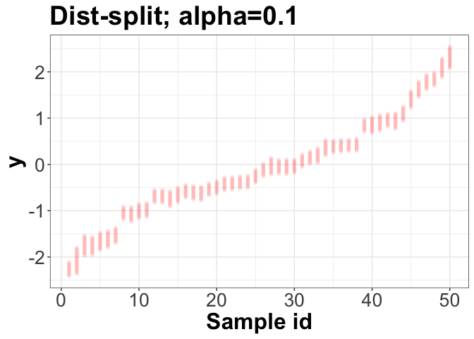
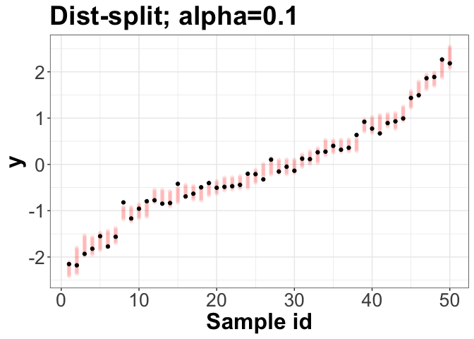
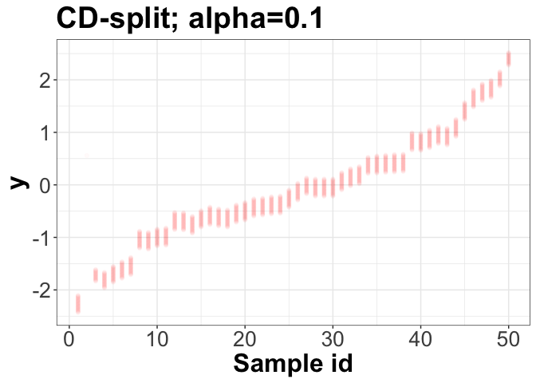
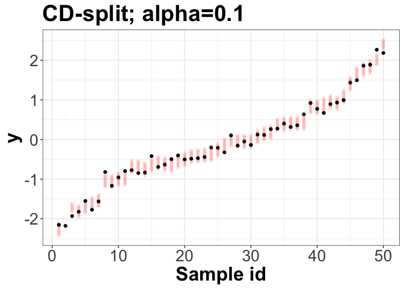

<!-- README.md is generated from README.Rmd. Please edit that file -->

# predictionBands

R package to compute distribution-free prediction bands using density
estimators according to

Izbicki, R., Shimizu, G. Y., Stern, R. B. (2019). [Distribution-free
conditional predictive bands using density
estimators](https://arxiv.org/abs/1910.05575).

The package estimates conditional densities using
[FlexCode](https://github.com/rizbicki/FlexCoDE/). (More on FlexCoDE:
Izbicki, R.; Lee, A.B. [Converting High-Dimensional Regression to
High-Dimensional Conditional Density
Estimation](https://projecteuclid.org/euclid.ejs/1499133755). Electronic
Journal of Statistics, 2017)

Two types of bands are available: ‘dist-split’ returns intervals (ideal
for unimodal response distributions); ‘cd-split’ returns unions of
intervals (ideal for multimodal response distributions)

To install the package, run

``` r
# install.packages("devtools")
devtools::install_github("rizbicki/FlexCoDE")
devtools::install_github("rizbicki/predictionBands")
```

(this package requires FlexCoDE).

``` r
library(FlexCoDE)
library(predictionBands)
```

A simple example:

``` r
set.seed(1)
#generate data
n <- 1000
n_new <- 50
d <- 10
data <- matrix(NA,n,d+1)
x <- matrix(rnorm(n*d),n,d)
y <- x[,1] + rnorm(n,0,0.1)

# fit predictionBands object
fit <- fit_predictionBands(x,y,0.5,0.4,0.1)
```

    ## Warning in FlexCoDE::fitFlexCoDE(xTrain = x[splits == "Train", ], zTrain = y[splits == : 
    ##  the optimal I found was exactly nIMax; try increasing nIMax if you want to improve performance

``` r
# generate new data:
xnew <- matrix(rnorm(n_new*d),n_new,d)
xnew <- xnew[order(xnew[,1]), ] # so that plots can be well ordered 
ynew <- xnew[,1] + rnorm(n_new,0,0.1)

# compute prediction bands for new data:

#Dist-split
bands <- predict(fit,xnew,type="dist")
length(bands[[1]])
```

    ## [1] 1000

``` r
head(bands[[1]])
```

    ## [1] -2.818104 -2.811341 -2.804578 -2.797815 -2.791051 -2.784288

``` r
bands[[2]]
```

    ##        5%       95% 
    ## 0.1680900 0.8647835

``` r
plot(bands)
```

<!-- -->

``` r
plot(bands,ynew) # if ynew is available
```

<!-- -->

``` r
#CD-split
bands <- predict(fit,xnew,type="cd")
length(bands[[1]])
```

    ## [1] 1000

``` r
head(bands[[1]])
```

    ## [1] -2.818104 -2.811341 -2.804578 -2.797815 -2.791051 -2.784288

``` r
bands[[2]]
```

    ##  [1] 1.541018 1.541018 1.541018 1.541018 1.541018 1.541018 1.541018 1.541018
    ##  [9] 1.541018 1.541018 1.541018 1.541018 1.541018 1.541018 1.541018 1.541018
    ## [17] 1.541018 1.541018 1.541018 1.541018 1.541018 1.541018 1.541018 1.541018
    ## [25] 1.541018 1.541018 1.541018 1.541018 1.541018 1.541018 1.541018 1.541018
    ## [33] 1.541018 1.541018 1.541018 1.541018 1.541018 1.541018 1.541018 1.541018
    ## [41] 1.541018 1.541018 1.541018 1.541018 1.541018 1.541018 1.541018 1.541018
    ## [49] 1.541018 1.541018

``` r
plot(bands)
```

<!-- -->

``` r
plot(bands,ynew) # if ynew is available
```

<!-- -->
